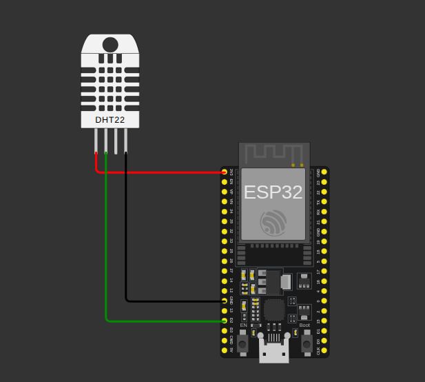
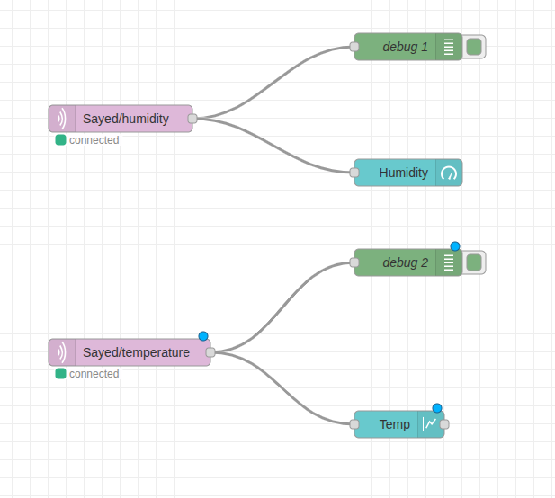
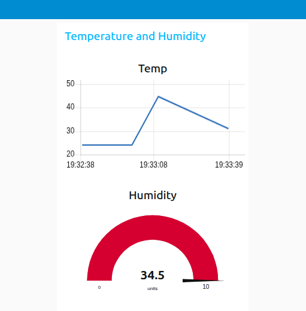

# Humidity-and-Temperature-IoT-Project
In this repo, I implemented an IoT project using Node-Red platform and Wokwi simulator to display the reading data from DHT22 sensor on the dashboard.

## Flow Diagram

The flow diagram illustrates that ESP32 takes data from DHT22 sensor as a client and then publishes this data using MQTT protcol to the broker and after that the broker sends this data to other clients as node-red to display it on the dashboard.

### 1: Install the Required Libraries
- Arduino IDE --> Tools --> Manage Libraries
- Search and install the following libraries
    ```
    WiFi
    DHT sensor library for ESPx
    pubsubclient
    ```
### 2: Project Schematic


### 3: How to run the program
- Copy the code to the Arduino IDE
- Setup the Board and Port
- Connect the ESP32 to the USB port of the computer
- Upload the code
- Monitor the values in the Serial monitor

### 4: Setup the Node-RED flow
- Deploy the flow of the Node-Red platform and then see the results in the dashboard.
- 
- Here is the dashboard of the project as shown below.
- 
